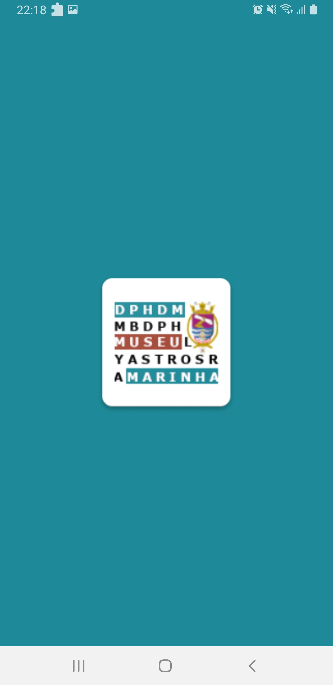
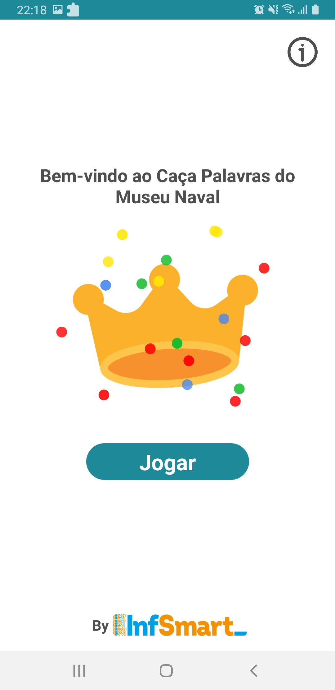
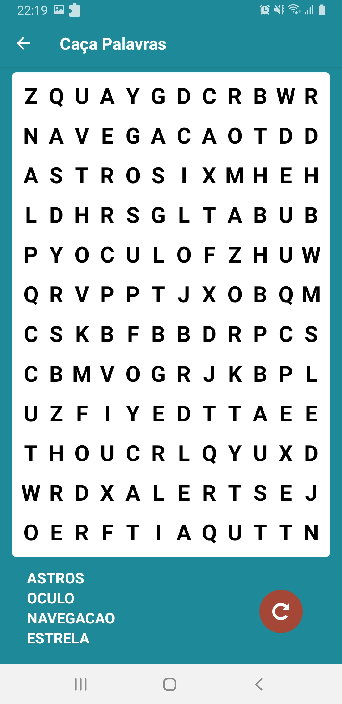
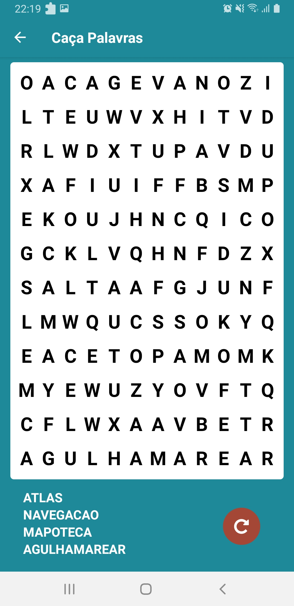
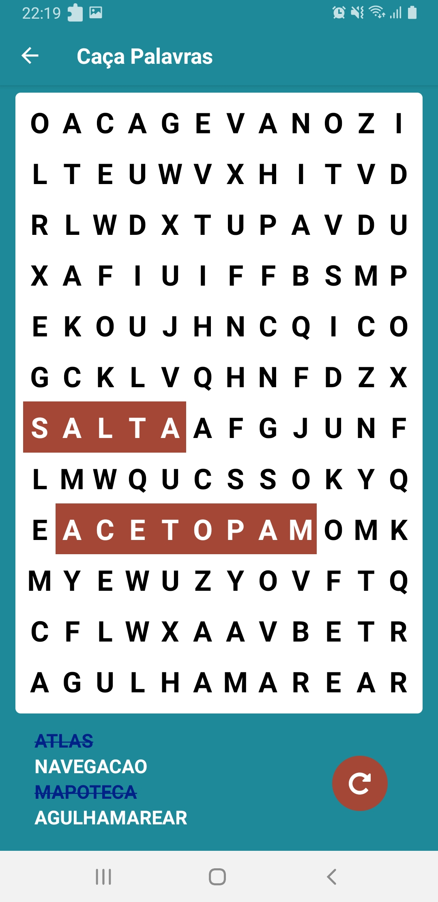
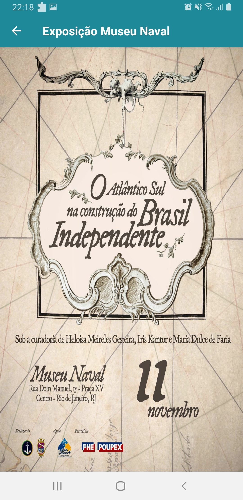

# Caça Palavras
 
### Olá! Eu sou Danielle Torres 👋

### Criei este aplicativo em apoio a Exposição no Museu Naval. Foi solicitado uma aplicação onde tivesse um jogo de Caça Palavras simples para que os visitantes da exposição pudessen jogar.
### Seguem abaixo as imagens do aplicativo Caça Palavras: 

 

    
     
    
     
    
     
     
      

### Utilizei a lib <a href="https://github.com/rogeriomattos/hunting-words" target="_blank">huting-words</a> fazendo algumas adaptações para minha aplicação.

### Tecnologia utilizada

     

